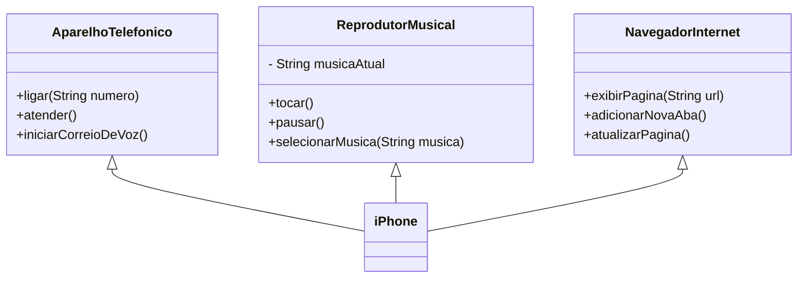

# Modelagem e diagramação de um componente iPhone

Você pode encontrar o enunciado do desafio nesse link: [Desafio POO DIO](https://github.com/digitalinnovationone/trilha-java-basico/tree/main/desafios/poo)

### Diagrama de classes
[Feito no Mermaid](https://mermaid.js.org/intro/syntax-reference.html)

